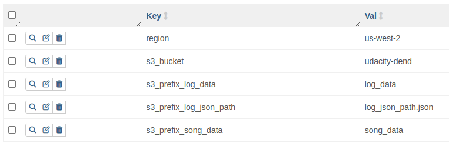

# Project: Data Pipelines with Airflow

A music streaming company, Sparkify, has decided that it is time to introduce more automation and monitoring to their data warehouse ETL pipelines and come to the conclusion that the best tool to achieve this is Apache Airflow.

They have decided to create high grade data pipelines that are dynamic and built from reusable tasks, can be monitored, and allow easy backfills. They have also noted that the data quality plays a big part when analyses are executed on top the data warehouse and want to run tests against their datasets after the ETL steps have been executed to catch any discrepancies in the datasets.

The source data resides in S3 and needs to be processed in Sparkify's data warehouse in Amazon Redshift. The source datasets consist of JSON logs that tell about user activity in the application and JSON metadata about the songs the users listen to.

## Prerequisites
- Create an IAM User in AWS.
  - An IAM user: `awsuser` has been created with permissions: 
    - `AdministrationAccess`
    - `AmazonRedshiftFullAccess`
    - `AmazonS3FullAccess`
  - On AWS Cloudshell, a role has been created. Using -

   ```
   aws iam create-role --role-name my-redshift-service-role --assume-role-policy-document '{
       "Version": "2012-10-17",
       "Statement": [
           {
               "Effect": "Allow",
               "Principal": {
                   "Service": "redshift.amazonaws.com"
               },
               "Action": "sts:AssumeRole"
           }
       ]
   }'

   aws iam attach-role-policy --policy-arn arn:aws:iam::aws:policy/AmazonS3FullAccess --role-name my-redshift-service-role
   ```

- Configure Redshift Serverless in AWS.
  - Create a Redshift serverless namespace and workspace.
    - Setup database and associate `IAM` role.
    - Make workspace publicly accessible temporarily.
    - Setup appropriate `Inbound` rules in the SecurityGroup.

## Deploy Airflow

```bash
export AIRFLOW_HOME=$HOME/local/airflow
pip install apache-airflow
pip install apache-airflow-providers-amazon
pip install apache-airflow-providers-google

airflow db init # Initialise Airflow

nano airflow.cfg  # Setup configuration
dags_folder = <project_folder>/dags
plugins_folder = <project_folder>/plugins

airflow users create --role Admin --username admin --email admin@example.com \
 --firstname admin --lastname admin --password passwd

airflow webserver -p 8080 # Start Airflow WebUI
airflow scheduler         # Start Scheduler
```

## Setting up Connections

- Connect Airflow and AWS
  - On Airflow WebUI. Navigate to `Menu` > `Admin` > `Connections`
  - Create/edit `aws_default` with `access_key`, `secret_key` and `session_token`.
  - Test and Save!


- Connect Airflow to AWS Redshift Serverless
  - On Airflow WebUI. Navigate to `Menu` > `Admin` > `Connections`
  - Create/edit `redshift` with `Host`, `Database`, `User`, `Password` and `Port`.
  - Test and Save!

- Setup Airflow Variables

   

## Project Structure

```bash
.
├── airflow1
│   ├── dags
│   └── plugins
│       ├── helpers
│       └── operators
├── assets
├── dags          # Airflow DAG Scripts
├── plugins       # Airflow operators and helpers 
│   ├── helpers
│   ├── operators
└── screen-shots  # Airflow and Redshift screenshots
```

## Running the Project

```bash
# Start Airflow
airflow webserver -p 8080
airflow scheduler
```

List DAGs `airflow dags list`. <br>To check Airflow - locate and run `hello_world` DAG on the WebUI.

1. Run `create_tables` DAG first to connect Redshift and create all the tables. 
   - Navigate to RedShift Query Editor on AWS to verify.

2. Then run `etl` DAG. This will execute tasks:
   - `Stage_events`
   - `Stage_songs`
   - `Load_songplays_fact_table`
   - `Load_song_dim_table`
   - `Load_user_dim_table`
   - `Load_artist_dim_table`
   - `Load_time_dim_table`
   - `Run_data_quality_checks`

If successful, all the data will be ingested to RedShift, see `screen-shots` dir.
